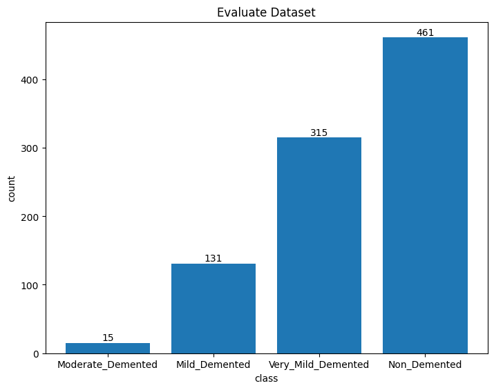

# Federated Learning

In this article, we will explore federated learning and gain an understanding of it through a scenario.

## Introduction

Federated learning, often referred to as collaborative learning, is a decentralized approach to training machine learning models. Its objective is to train a machine learning model on multiple local datasets contained in local nodes without explicitly exchanging data samples. This is in contrast to traditional centralized models, where data is aggregated in a single location for training. The decentralized approach not only reduces the need for transmitting sensitive data to a central server but also addresses privacy concerns associated with sharing personal information.

## Scenario

Let's illustrate federated learning with a scenario. Suppose a hospital has tasked us with creating a machine learning model to detect Alzheimer's Disease. However, the data provided is insufficient for training a model to make accurate predictions. To overcome this challenge, we decide to collaborate with other hospitals facing similar requirements. Unfortunately, all potential collaborators are hesitant to share data due to concerns about patient privacy.

In this scenario, federated learning emerges as a solution to learn from data without compromising privacy. The machine learning model learns within each client's environment and shares the acquired knowledge back to the server. This way, the knowledge from different clients could be combined into a single powerful model without need for clients to share raw data and risk patient's privacy.

## Tools

We will utilize the Flower Framework to implement Federated Learning (FL) and create a client-server architecture. For more information, please refer to the official [documentation](https://flower.dev/docs/framework/index.html). Additionally, we will use PyTorch to define our Convolutional Neural Network (CNN) model.

## Dataset

We will work with two clients, each having its dataset stored under the `./datasets` folder. For clarity, we have organized the datasets into separate folders, ensuring that *client1* only accesses data from `./datasets/client1client1`, and *client2* from `./datasets/client2`. In a real-world scenario, these datasets would be present and isolated on different client machines. Additionally, there is a distinct evaluation dataset stored in the `./datasets/evaluate` folder, accessible only by the server.

|Client 1 Dataset|Client 2 Dataset|Evaluate Dataset|
|:-:|:-:|:-:|
||

|Dataset Samples|
|:-:|
||

## Implementation

- `model.py`: This file contains the model definition along with instructions for training and validation.
- `server.py`: This file contains the Federated Learning (FL) server, aggregation strategies, and evaluation procedures.
- `federated_client.py`: In this file, you'll find the FL client implementation, covering how to send and receive data, as well as setting parameters.
- `report.py`: This file serves as a helper, facilitating the generation of reports on the server.
- `client1.py`: This file contains the implementation of the federated client for Client 1.
- `client2.py`: In this file, you'll find the implementation of the federated client for Client 2.

## Training & Testing

The sequence diagram below illustrates how the model learns without sharing data with the server:


1. The server initially generates random model parameters/weights and shares them with connected clients.
2. Clients use these initial model parameters/weights to start training with their local data, following the instructions defined in the client code.
3. After completing the training, the clients share the trained parameters/weights back with the server.
4. Upon receiving the trained parameters/weights from all connected clients, the server performs aggregation using a defined aggregation function.
5. The aggregated parameters/weights are then used to evaluate the model accuracy on the server, utilizing a local test dataset.
6. The newly aggregated parameters/weights are sent to clients for the next round of training, and the cycle continues for N rounds.

It's worth noting that there are two main approaches to evaluating models in federated learning systems: centralized (or server-side) evaluation and federated (or client-side) evaluation. In this implementation, we have opted for the centralized approach for its simplicity.

## Aggregators

In Federated Learning (FL), aggregators play a crucial role in combining the knowledge learned by individual clients during their training processes. These functions are responsible for merging the model updates or parameters received from different clients into a single, updated model at the central server.

In our FL implementation, we have defined five aggregation strategies. You can update the strategy variable in server.py to point to any of these aggregators:

- [FedAvg](https://flower.dev/docs/framework/ref-api/flwr.server.strategy.FedAvg.html) (Federated Averaging)
- [FedYogi](https://flower.dev/docs/framework/ref-api/flwr.server.strategy.FedYogi.html) (Adaptive Federated Optimization using Yogi)
- [FedOpt](https://flower.dev/docs/framework/ref-api/flwr.server.strategy.FedOpt.html) (Federated Optim strategy)
- [FedMedian](https://flower.dev/docs/framework/ref-api/flwr.server.strategy.FedMedian.html) (Configurable FedMedian strategy)
- [FedTrimmedAvg](https://flower.dev/docs/framework/ref-api/flwr.server.strategy.FedTrimmedAvg.html) (Federated Averaging with Trimmed Mean)

The choice of aggregator depends on the specific requirements of the FL scenario, including the nature of the data, privacy considerations, and the desired model performance. Experimenting with different aggregators allows customization to meet the specific needs of a given use case.

## Demo

- Start server
  ```bash
  python3 server.py
  ```
  <details>
    <summary>Server Logs</summary>

    ```bash
    INFO flwr 2024-01-21 14:49:32,018 | app.py:163 | Starting Flower server, config: ServerConfig(num_rounds=20, round_timeout=None)
    INFO flwr 2024-01-21 14:49:32,031 | app.py:176 | Flower ECE: gRPC server running (20 rounds), SSL is disabled
    INFO flwr 2024-01-21 14:49:32,032 | server.py:89 | Initializing global parameters
    INFO flwr 2024-01-21 14:49:32,032 | server.py:272 | Using initial parameters provided by strategy
    INFO flwr 2024-01-21 14:49:32,032 | server.py:91 | Evaluating initial parameters
    Evaluating on 918 unseen images
    Testing completed, Test Acc: 1.53%.
    INFO flwr 2024-01-21 14:49:32,594 | server.py:94 | initial parameters (loss, other metrics): 40.91773438453674, {'acc': 1.5250544662309369}
    INFO flwr 2024-01-21 14:49:32,594 | server.py:104 | FL starting
    DEBUG flwr 2024-01-21 14:49:42,641 | server.py:222 | fit_round 1: strategy sampled 2 clients (out of 2)
    DEBUG flwr 2024-01-21 14:50:08,857 | server.py:236 | fit_round 1 received 2 results and 0 failures
    Evaluating on 918 unseen images
    Testing completed, Test Acc: 61.87%.
    INFO flwr 2024-01-21 14:50:09,400 | server.py:125 | fit progress: (1, 30.719981789588928, {'acc': 61.87363834422658}, 36.806152375007514)
    DEBUG flwr 2024-01-21 14:50:09,400 | server.py:173 | evaluate_round 1: strategy sampled 2 clients (out of 2)
    DEBUG flwr 2024-01-21 14:50:09,404 | server.py:187 | evaluate_round 1 received 2 results and 0 failures
    WARNING flwr 2024-01-21 14:50:09,404 | fedavg.py:273 | No evaluate_metrics_aggregation_fn provided
    DEBUG flwr 2024-01-21 14:50:09,404 | server.py:222 | fit_round 2: strategy sampled 2 clients (out of 2)
    DEBUG flwr 2024-01-21 14:50:35,788 | server.py:236 | fit_round 2 received 2 results and 0 failures
    Evaluating on 918 unseen images
    Testing completed, Test Acc: 65.47%.
    INFO flwr 2024-01-21 14:50:36,319 | server.py:125 | fit progress: (2, 26.998421907424927, {'acc': 65.46840958605665}, 63.72475720796501)
    DEBUG flwr 2024-01-21 14:50:36,319 | server.py:173 | evaluate_round 2: strategy sampled 2 clients (out of 2)
    DEBUG flwr 2024-01-21 14:50:36,322 | server.py:187 | evaluate_round 2 received 2 results and 0 failures
    DEBUG flwr 2024-01-21 14:50:36,323 | server.py:222 | fit_round 3: strategy sampled 2 clients (out of 2)
    DEBUG flwr 2024-01-21 14:51:02,784 | server.py:236 | fit_round 3 received 2 results and 0 failures
    Evaluating on 918 unseen images
    Testing completed, Test Acc: 66.45%.
    INFO flwr 2024-01-21 14:51:03,316 | server.py:125 | fit progress: (3, 45.87824475765228, {'acc': 66.44880174291939}, 90.72264720796375)
    DEBUG flwr 2024-01-21 14:51:03,317 | server.py:173 | evaluate_round 3: strategy sampled 2 clients (out of 2)
    DEBUG flwr 2024-01-21 14:51:03,320 | server.py:187 | evaluate_round 3 received 2 results and 0 failures
    DEBUG flwr 2024-01-21 14:51:03,320 | server.py:222 | fit_round 4: strategy sampled 2 clients (out of 2)
    DEBUG flwr 2024-01-21 14:51:29,366 | server.py:236 | fit_round 4 received 2 results and 0 failures
    Evaluating on 918 unseen images
    Testing completed, Test Acc: 59.37%.
    INFO flwr 2024-01-21 14:51:29,915 | server.py:125 | fit progress: (4, 50.75293606519699, {'acc': 59.368191721132895}, 117.32141324999975)
    DEBUG flwr 2024-01-21 14:51:29,915 | server.py:173 | evaluate_round 4: strategy sampled 2 clients (out of 2)
    DEBUG flwr 2024-01-21 14:51:29,919 | server.py:187 | evaluate_round 4 received 2 results and 0 failures
    DEBUG flwr 2024-01-21 14:51:29,919 | server.py:222 | fit_round 5: strategy sampled 2 clients (out of 2)
    DEBUG flwr 2024-01-21 14:51:56,750 | server.py:236 | fit_round 5 received 2 results and 0 failures
    Evaluating on 918 unseen images
    Testing completed, Test Acc: 56.21%.
    INFO flwr 2024-01-21 14:51:57,307 | server.py:125 | fit progress: (5, 41.84265488386154, {'acc': 56.209150326797385}, 144.71339374996023)
    DEBUG flwr 2024-01-21 14:51:57,307 | server.py:173 | evaluate_round 5: strategy sampled 2 clients (out of 2)
    DEBUG flwr 2024-01-21 14:51:57,311 | server.py:187 | evaluate_round 5 received 2 results and 0 failures
    DEBUG flwr 2024-01-21 14:51:57,311 | server.py:222 | fit_round 6: strategy sampled 2 clients (out of 2)
    DEBUG flwr 2024-01-21 14:52:23,955 | server.py:236 | fit_round 6 received 2 results and 0 failures
    Evaluating on 918 unseen images
    Testing completed, Test Acc: 61.76%.
    INFO flwr 2024-01-21 14:52:24,495 | server.py:125 | fit progress: (6, 24.07293325662613, {'acc': 61.76470588235294}, 171.90165799995884)
    DEBUG flwr 2024-01-21 14:52:24,495 | server.py:173 | evaluate_round 6: strategy sampled 2 clients (out of 2)
    DEBUG flwr 2024-01-21 14:52:24,499 | server.py:187 | evaluate_round 6 received 2 results and 0 failures
    DEBUG flwr 2024-01-21 14:52:24,499 | server.py:222 | fit_round 7: strategy sampled 2 clients (out of 2)
    DEBUG flwr 2024-01-21 14:52:50,360 | server.py:236 | fit_round 7 received 2 results and 0 failures
    Evaluating on 918 unseen images
    Testing completed, Test Acc: 71.02%.
    INFO flwr 2024-01-21 14:52:50,902 | server.py:125 | fit progress: (7, 17.60585653781891, {'acc': 71.0239651416122}, 198.31223466596566)
    DEBUG flwr 2024-01-21 14:52:50,902 | server.py:173 | evaluate_round 7: strategy sampled 2 clients (out of 2)
    DEBUG flwr 2024-01-21 14:52:50,905 | server.py:187 | evaluate_round 7 received 2 results and 0 failures
    DEBUG flwr 2024-01-21 14:52:50,905 | server.py:222 | fit_round 8: strategy sampled 2 clients (out of 2)
    DEBUG flwr 2024-01-21 14:53:17,137 | server.py:236 | fit_round 8 received 2 results and 0 failures
    Evaluating on 918 unseen images
    Testing completed, Test Acc: 76.14%.
    INFO flwr 2024-01-21 14:53:17,693 | server.py:125 | fit progress: (8, 17.596911072731018, {'acc': 76.14379084967321}, 225.10630529100308)
    DEBUG flwr 2024-01-21 14:53:17,693 | server.py:173 | evaluate_round 8: strategy sampled 2 clients (out of 2)
    DEBUG flwr 2024-01-21 14:53:17,696 | server.py:187 | evaluate_round 8 received 2 results and 0 failures
    DEBUG flwr 2024-01-21 14:53:17,696 | server.py:222 | fit_round 9: strategy sampled 2 clients (out of 2)
    DEBUG flwr 2024-01-21 14:53:43,646 | server.py:236 | fit_round 9 received 2 results and 0 failures
    Evaluating on 918 unseen images
    Testing completed, Test Acc: 80.50%.
    INFO flwr 2024-01-21 14:53:44,188 | server.py:125 | fit progress: (9, 18.02427127957344, {'acc': 80.50108932461873}, 251.60259579098783)
    DEBUG flwr 2024-01-21 14:53:44,189 | server.py:173 | evaluate_round 9: strategy sampled 2 clients (out of 2)
    DEBUG flwr 2024-01-21 14:53:44,192 | server.py:187 | evaluate_round 9 received 2 results and 0 failures
    DEBUG flwr 2024-01-21 14:53:44,192 | server.py:222 | fit_round 10: strategy sampled 2 clients (out of 2)
    DEBUG flwr 2024-01-21 14:54:10,068 | server.py:236 | fit_round 10 received 2 results and 0 failures
    Evaluating on 918 unseen images
    Testing completed, Test Acc: 80.17%.
    INFO flwr 2024-01-21 14:54:10,614 | server.py:125 | fit progress: (10, 18.27769936621189, {'acc': 80.17429193899783}, 278.02828587498516)
    DEBUG flwr 2024-01-21 14:54:10,614 | server.py:173 | evaluate_round 10: strategy sampled 2 clients (out of 2)
    DEBUG flwr 2024-01-21 14:54:10,618 | server.py:187 | evaluate_round 10 received 2 results and 0 failures
    DEBUG flwr 2024-01-21 14:54:10,618 | server.py:222 | fit_round 11: strategy sampled 2 clients (out of 2)
    DEBUG flwr 2024-01-21 14:54:36,480 | server.py:236 | fit_round 11 received 2 results and 0 failures
    Evaluating on 918 unseen images
    Testing completed, Test Acc: 82.35%.
    INFO flwr 2024-01-21 14:54:37,016 | server.py:125 | fit progress: (11, 14.882275775074959, {'acc': 82.3529411764706}, 304.4300611660001)
    DEBUG flwr 2024-01-21 14:54:37,016 | server.py:173 | evaluate_round 11: strategy sampled 2 clients (out of 2)
    DEBUG flwr 2024-01-21 14:54:37,019 | server.py:187 | evaluate_round 11 received 2 results and 0 failures
    DEBUG flwr 2024-01-21 14:54:37,019 | server.py:222 | fit_round 12: strategy sampled 2 clients (out of 2)
    DEBUG flwr 2024-01-21 14:55:03,194 | server.py:236 | fit_round 12 received 2 results and 0 failures
    Evaluating on 918 unseen images
    Testing completed, Test Acc: 85.19%.
    INFO flwr 2024-01-21 14:55:03,739 | server.py:125 | fit progress: (12, 11.632547616958618, {'acc': 85.18518518518519}, 331.1540185409831)
    DEBUG flwr 2024-01-21 14:55:03,739 | server.py:173 | evaluate_round 12: strategy sampled 2 clients (out of 2)
    DEBUG flwr 2024-01-21 14:55:03,743 | server.py:187 | evaluate_round 12 received 2 results and 0 failures
    DEBUG flwr 2024-01-21 14:55:03,743 | server.py:222 | fit_round 13: strategy sampled 2 clients (out of 2)
    DEBUG flwr 2024-01-21 14:55:29,638 | server.py:236 | fit_round 13 received 2 results and 0 failures
    Evaluating on 918 unseen images
    Testing completed, Test Acc: 88.24%.
    INFO flwr 2024-01-21 14:55:30,185 | server.py:125 | fit progress: (13, 10.791808657348156, {'acc': 88.23529411764706}, 357.5995429159957)
    DEBUG flwr 2024-01-21 14:55:30,185 | server.py:173 | evaluate_round 13: strategy sampled 2 clients (out of 2)
    DEBUG flwr 2024-01-21 14:55:30,189 | server.py:187 | evaluate_round 13 received 2 results and 0 failures
    DEBUG flwr 2024-01-21 14:55:30,189 | server.py:222 | fit_round 14: strategy sampled 2 clients (out of 2)
    DEBUG flwr 2024-01-21 14:55:56,208 | server.py:236 | fit_round 14 received 2 results and 0 failures
    Evaluating on 918 unseen images
    Testing completed, Test Acc: 87.80%.
    INFO flwr 2024-01-21 14:55:56,751 | server.py:125 | fit progress: (14, 10.349341794848442, {'acc': 87.7995642701525}, 384.16629079100676)
    DEBUG flwr 2024-01-21 14:55:56,751 | server.py:173 | evaluate_round 14: strategy sampled 2 clients (out of 2)
    DEBUG flwr 2024-01-21 14:55:56,755 | server.py:187 | evaluate_round 14 received 2 results and 0 failures
    DEBUG flwr 2024-01-21 14:55:56,755 | server.py:222 | fit_round 15: strategy sampled 2 clients (out of 2)
    DEBUG flwr 2024-01-21 14:56:22,800 | server.py:236 | fit_round 15 received 2 results and 0 failures
    Evaluating on 918 unseen images
    Testing completed, Test Acc: 89.22%.
    INFO flwr 2024-01-21 14:56:23,348 | server.py:125 | fit progress: (15, 10.75094494316727, {'acc': 89.2156862745098}, 410.7631896659732)
    DEBUG flwr 2024-01-21 14:56:23,348 | server.py:173 | evaluate_round 15: strategy sampled 2 clients (out of 2)
    DEBUG flwr 2024-01-21 14:56:23,351 | server.py:187 | evaluate_round 15 received 2 results and 0 failures
    DEBUG flwr 2024-01-21 14:56:23,351 | server.py:222 | fit_round 16: strategy sampled 2 clients (out of 2)
    DEBUG flwr 2024-01-21 14:56:49,421 | server.py:236 | fit_round 16 received 2 results and 0 failures
    Evaluating on 918 unseen images
    Testing completed, Test Acc: 90.52%.
    INFO flwr 2024-01-21 14:56:49,980 | server.py:125 | fit progress: (16, 11.651554591953754, {'acc': 90.52287581699346}, 437.39565020799637)
    DEBUG flwr 2024-01-21 14:56:49,981 | server.py:173 | evaluate_round 16: strategy sampled 2 clients (out of 2)
    DEBUG flwr 2024-01-21 14:56:49,984 | server.py:187 | evaluate_round 16 received 2 results and 0 failures
    DEBUG flwr 2024-01-21 14:56:49,984 | server.py:222 | fit_round 17: strategy sampled 2 clients (out of 2)
    DEBUG flwr 2024-01-21 14:57:16,385 | server.py:236 | fit_round 17 received 2 results and 0 failures
    Evaluating on 918 unseen images
    Testing completed, Test Acc: 90.52%.
    INFO flwr 2024-01-21 14:57:16,933 | server.py:125 | fit progress: (17, 14.33097967505455, {'acc': 90.52287581699346}, 464.3484304159647)
    DEBUG flwr 2024-01-21 14:57:16,933 | server.py:173 | evaluate_round 17: strategy sampled 2 clients (out of 2)
    DEBUG flwr 2024-01-21 14:57:16,938 | server.py:187 | evaluate_round 17 received 2 results and 0 failures
    DEBUG flwr 2024-01-21 14:57:16,938 | server.py:222 | fit_round 18: strategy sampled 2 clients (out of 2)
    DEBUG flwr 2024-01-21 14:57:43,615 | server.py:236 | fit_round 18 received 2 results and 0 failures
    Evaluating on 918 unseen images
    Testing completed, Test Acc: 89.32%.
    INFO flwr 2024-01-21 14:57:44,177 | server.py:125 | fit progress: (18, 15.421888388693333, {'acc': 89.32461873638344}, 491.59296754095703)
    DEBUG flwr 2024-01-21 14:57:44,178 | server.py:173 | evaluate_round 18: strategy sampled 2 clients (out of 2)
    DEBUG flwr 2024-01-21 14:57:44,181 | server.py:187 | evaluate_round 18 received 2 results and 0 failures
    DEBUG flwr 2024-01-21 14:57:44,181 | server.py:222 | fit_round 19: strategy sampled 2 clients (out of 2)
    DEBUG flwr 2024-01-21 14:58:10,991 | server.py:236 | fit_round 19 received 2 results and 0 failures
    Evaluating on 918 unseen images
    Testing completed, Test Acc: 91.07%.
    INFO flwr 2024-01-21 14:58:11,550 | server.py:125 | fit progress: (19, 11.146589921787381, {'acc': 91.06753812636165}, 518.9652454580064)
    DEBUG flwr 2024-01-21 14:58:11,550 | server.py:173 | evaluate_round 19: strategy sampled 2 clients (out of 2)
    DEBUG flwr 2024-01-21 14:58:11,552 | server.py:187 | evaluate_round 19 received 2 results and 0 failures
    DEBUG flwr 2024-01-21 14:58:11,553 | server.py:222 | fit_round 20: strategy sampled 2 clients (out of 2)
    DEBUG flwr 2024-01-21 14:58:37,990 | server.py:236 | fit_round 20 received 2 results and 0 failures
    Evaluating on 918 unseen images
    Testing completed, Test Acc: 91.83%.
    INFO flwr 2024-01-21 14:58:38,538 | server.py:125 | fit progress: (20, 10.519964098930359, {'acc': 91.83006535947712}, 545.9536046659923)
    DEBUG flwr 2024-01-21 14:58:38,538 | server.py:173 | evaluate_round 20: strategy sampled 2 clients (out of 2)
    DEBUG flwr 2024-01-21 14:58:38,541 | server.py:187 | evaluate_round 20 received 2 results and 0 failures
    INFO flwr 2024-01-21 14:58:38,541 | server.py:153 | FL finished in 545.9571379160043
    INFO flwr 2024-01-21 14:58:38,542 | app.py:226 | app_fit: losses_distributed [(1, 0.0), (2, 0.0), (3, 0.0), (4, 0.0), (5, 0.0), (6, 0.0), (7, 0.0), (8, 0.0), (9, 0.0), (10, 0.0), (11, 0.0), (12, 0.0), (13, 0.0), (14, 0.0), (15, 0.0), (16, 0.0), (17, 0.0), (18, 0.0), (19, 0.0), (20, 0.0)]
    INFO flwr 2024-01-21 14:58:38,542 | app.py:227 | app_fit: metrics_distributed_fit {'data': [(1, [(2, {'acc': 64.6376811594203, 'loss': 0.8082679187312074, 'examples': 2177}), (1, {'acc': 62.829193376068375, 'loss': 0.848464569162864, 'examples': 3305})]), (2, [(1, {'acc': 67.41653311965811, 'loss': 0.7446340602750962, 'examples': 3305}), (2, {'acc': 68.82246376811594, 'loss': 0.6592105335299518, 'examples': 2177})]), (3, [(1, {'acc': 69.64409722222221, 'loss': 0.7005000228492113, 'examples': 3305}), (2, {'acc': 72.7626811594203, 'loss': 0.5795070012444226, 'examples': 2177})]), (4, [(1, {'acc': 72.44457799145299, 'loss': 0.6745054729282856, 'examples': 3305}), (2, {'acc': 74.64673913043478, 'loss': 0.5692940775922539, 'examples': 2177})]), (5, [(1, {'acc': 73.76869658119658, 'loss': 0.639855510282975, 'examples': 3305}), (2, {'acc': 77.6268115942029, 'loss': 0.5060832277456623, 'examples': 2177})]), (6, [(1, {'acc': 75.0647702991453, 'loss': 0.586981585664818, 'examples': 3305}), (2, {'acc': 80.2445652173913, 'loss': 0.4565298913484751, 'examples': 2177})]), (7, [(1, {'acc': 78.2678952991453, 'loss': 0.5076413337714396, 'examples': 3305}), (2, {'acc': 84.13949275362319, 'loss': 0.36192050837975775, 'examples': 2177})]), (8, [(2, {'acc': 89.16666666666666, 'loss': 0.2587839468179139, 'examples': 2177}), (1, {'acc': 82.09134615384615, 'loss': 0.42776484559648315, 'examples': 3305})]), (9, [(2, {'acc': 93.10688405797102, 'loss': 0.17728661076449084, 'examples': 2177}), (1, {'acc': 85.83333333333333, 'loss': 0.3481240411933798, 'examples': 3305})]), (10, [(2, {'acc': 94.96376811594203, 'loss': 0.13395056772241187, 'examples': 2177}), (1, {'acc': 88.14236111111111, 'loss': 0.28699395091702734, 'examples': 3305})]), (11, [(2, {'acc': 96.7663043478261, 'loss': 0.10102385312484989, 'examples': 2177}), (1, {'acc': 90.96420940170938, 'loss': 0.24130965758544892, 'examples': 3305})]), (12, [(1, {'acc': 92.89663461538461, 'loss': 0.19282871532665852, 'examples': 3305}), (2, {'acc': 98.80434782608695, 'loss': 0.04114568474178668, 'examples': 2177})]), (13, [(1, {'acc': 92.89930555555557, 'loss': 0.19732443591794716, 'examples': 3305}), (2, {'acc': 99.23913043478261, 'loss': 0.02580071279428565, 'examples': 2177})]), (14, [(2, {'acc': 96.08695652173914, 'loss': 0.18309611508479615, 'examples': 2177}), (1, {'acc': 95.25173611111111, 'loss': 0.13341416658815713, 'examples': 3305})]), (15, [(1, {'acc': 97.50600961538461, 'loss': 0.07913616518008684, 'examples': 3305}), (2, {'acc': 98.6322463768116, 'loss': 0.05479073647840491, 'examples': 2177})]), (16, [(2, {'acc': 99.7554347826087, 'loss': 0.00809384744927486, 'examples': 2177}), (1, {'acc': 97.6923076923077, 'loss': 0.07110161412028114, 'examples': 3305})]), (17, [(2, {'acc': 99.59239130434783, 'loss': 0.014720968993664051, 'examples': 2177}), (1, {'acc': 98.63848824786325, 'loss': 0.050506321408237964, 'examples': 3305})]), (18, [(1, {'acc': 98.68990384615384, 'loss': 0.051619163709878756, 'examples': 3305}), (2, {'acc': 99.51086956521739, 'loss': 0.02538409892768091, 'examples': 2177})]), (19, [(1, {'acc': 98.32598824786325, 'loss': 0.06380170818676253, 'examples': 3305}), (2, {'acc': 99.7554347826087, 'loss': 0.01094710331200592, 'examples': 2177})]), (20, [(1, {'acc': 99.48317307692307, 'loss': 0.020995480549828933, 'examples': 3305}), (2, {'acc': 99.81884057971016, 'loss': 0.008362542215549076, 'examples': 2177})])]}
    INFO flwr 2024-01-21 14:58:38,542 | app.py:228 | app_fit: metrics_distributed {}
    INFO flwr 2024-01-21 14:58:38,542 | app.py:229 | app_fit: losses_centralized [(0, 40.91773438453674), (1, 30.719981789588928), (2, 26.998421907424927), (3, 45.87824475765228), (4, 50.75293606519699), (5, 41.84265488386154), (6, 24.07293325662613), (7, 17.60585653781891), (8, 17.596911072731018), (9, 18.02427127957344), (10, 18.27769936621189), (11, 14.882275775074959), (12, 11.632547616958618), (13, 10.791808657348156), (14, 10.349341794848442), (15, 10.75094494316727), (16, 11.651554591953754), (17, 14.33097967505455), (18, 15.421888388693333), (19, 11.146589921787381), (20, 10.519964098930359)]
    INFO flwr 2024-01-21 14:58:38,542 | app.py:230 | app_fit: metrics_centralized {'acc': [(0, 1.5250544662309369), (1, 61.87363834422658), (2, 65.46840958605665), (3, 66.44880174291939), (4, 59.368191721132895), (5, 56.209150326797385), (6, 61.76470588235294), (7, 71.0239651416122), (8, 76.14379084967321), (9, 80.50108932461873), (10, 80.17429193899783), (11, 82.3529411764706), (12, 85.18518518518519), (13, 88.23529411764706), (14, 87.7995642701525), (15, 89.2156862745098), (16, 90.52287581699346), (17, 90.52287581699346), (18, 89.32461873638344), (19, 91.06753812636165), (20, 91.83006535947712)]}
    No artists with labels found to put in legend.  Note that artists whose label start with an underscore are ignored when legend() is called with no argument.
    +---------------+------------+
    |      Aggr     | Test Acc % |
    +---------------+------------+
    |   Centralize  |   94.77    |
    |     FedAvg    |   93.90    |
    |    FedYogi    |   91.83    |
    | FedTrimmedAvg |   94.44    |
    |     FedOpt    |   93.79    |
    |   FedMedian   |   93.90    |
    +---------------+------------+
    ```

  </details> 
- Start client1
  ```bash
  python3 client1.py
  ```
  <details>
    <summary>Client1 Logs</summary>

    ```bash
    Initializing client.....
    Loading data from ./datasets/client1/alzheimers directory.....
    INFO flwr 2024-01-21 14:49:38,903 | grpc.py:52 | Opened insecure gRPC connection (no certificates were passed)
    DEBUG flwr 2024-01-21 14:49:38,903 | connection.py:42 | ChannelConnectivity.IDLE
    DEBUG flwr 2024-01-21 14:49:38,903 | connection.py:42 | ChannelConnectivity.CONNECTING
    DEBUG flwr 2024-01-21 14:49:38,904 | connection.py:42 | ChannelConnectivity.READY
    Training Round 1
    Setting new model parameters.....
    Training on 3305 images for 5 epochs.....
    Epoch [1/5], Training Loss: 1.1371, Training Acc: 48.84%
    Epoch [2/5], Training Loss: 0.8560, Training Acc: 63.53%
    Epoch [3/5], Training Loss: 0.7747, Training Acc: 66.85%
    Epoch [4/5], Training Loss: 0.7411, Training Acc: 67.71%
    Epoch [5/5], Training Loss: 0.7334, Training Acc: 67.21%
    Training completed, Avg Training Loss: 0.85, Avg Training Acc: 62.83%.
    Getting new model parameters.....
    Training Round 2
    Setting new model parameters.....
    Training on 3305 images for 5 epochs.....
    Epoch [1/5], Training Loss: 0.8719, Training Acc: 62.27%
    Epoch [2/5], Training Loss: 0.7429, Training Acc: 67.19%
    Epoch [3/5], Training Loss: 0.7222, Training Acc: 68.05%
    Epoch [4/5], Training Loss: 0.6990, Training Acc: 69.77%
    Epoch [5/5], Training Loss: 0.6871, Training Acc: 69.80%
    Training completed, Avg Training Loss: 0.74, Avg Training Acc: 67.42%.
    Getting new model parameters.....
    Training Round 3
    Setting new model parameters.....
    Training on 3305 images for 5 epochs.....
    Epoch [1/5], Training Loss: 0.8130, Training Acc: 65.63%
    Epoch [2/5], Training Loss: 0.6959, Training Acc: 69.42%
    Epoch [3/5], Training Loss: 0.6785, Training Acc: 69.88%
    Epoch [4/5], Training Loss: 0.6555, Training Acc: 72.07%
    Epoch [5/5], Training Loss: 0.6595, Training Acc: 71.23%
    Training completed, Avg Training Loss: 0.70, Avg Training Acc: 69.64%.
    Getting new model parameters.....
    Training Round 4
    Setting new model parameters.....
    Training on 3305 images for 5 epochs.....
    Epoch [1/5], Training Loss: 0.8705, Training Acc: 69.29%
    Epoch [2/5], Training Loss: 0.6541, Training Acc: 71.83%
    Epoch [3/5], Training Loss: 0.6381, Training Acc: 73.16%
    Epoch [4/5], Training Loss: 0.6131, Training Acc: 73.61%
    Epoch [5/5], Training Loss: 0.5967, Training Acc: 74.34%
    Training completed, Avg Training Loss: 0.67, Avg Training Acc: 72.44%.
    Getting new model parameters.....
    Training Round 5
    Setting new model parameters.....
    Training on 3305 images for 5 epochs.....
    Epoch [1/5], Training Loss: 0.8603, Training Acc: 69.03%
    Epoch [2/5], Training Loss: 0.6201, Training Acc: 73.07%
    Epoch [3/5], Training Loss: 0.5910, Training Acc: 74.28%
    Epoch [4/5], Training Loss: 0.5769, Training Acc: 75.36%
    Epoch [5/5], Training Loss: 0.5510, Training Acc: 77.10%
    Training completed, Avg Training Loss: 0.64, Avg Training Acc: 73.77%.
    Getting new model parameters.....
    Training Round 6
    Setting new model parameters.....
    Training on 3305 images for 5 epochs.....
    Epoch [1/5], Training Loss: 0.7336, Training Acc: 69.93%
    Epoch [2/5], Training Loss: 0.5977, Training Acc: 73.79%
    Epoch [3/5], Training Loss: 0.5552, Training Acc: 76.92%
    Epoch [4/5], Training Loss: 0.5472, Training Acc: 75.77%
    Epoch [5/5], Training Loss: 0.5012, Training Acc: 78.91%
    Training completed, Avg Training Loss: 0.59, Avg Training Acc: 75.06%.
    Getting new model parameters.....
    Training Round 7
    Setting new model parameters.....
    Training on 3305 images for 5 epochs.....
    Epoch [1/5], Training Loss: 0.6425, Training Acc: 72.13%
    Epoch [2/5], Training Loss: 0.5252, Training Acc: 77.39%
    Epoch [3/5], Training Loss: 0.4850, Training Acc: 79.79%
    Epoch [4/5], Training Loss: 0.4698, Training Acc: 79.39%
    Epoch [5/5], Training Loss: 0.4158, Training Acc: 82.65%
    Training completed, Avg Training Loss: 0.51, Avg Training Acc: 78.27%.
    Getting new model parameters.....
    Training Round 8
    Setting new model parameters.....
    Training on 3305 images for 5 epochs.....
    Epoch [1/5], Training Loss: 0.5861, Training Acc: 75.30%
    Epoch [2/5], Training Loss: 0.4449, Training Acc: 81.29%
    Epoch [3/5], Training Loss: 0.3986, Training Acc: 83.46%
    Epoch [4/5], Training Loss: 0.3683, Training Acc: 84.76%
    Epoch [5/5], Training Loss: 0.3409, Training Acc: 85.65%
    Training completed, Avg Training Loss: 0.43, Avg Training Acc: 82.09%.
    Getting new model parameters.....
    Training Round 9
    Setting new model parameters.....
    Training on 3305 images for 5 epochs.....
    Epoch [1/5], Training Loss: 0.4662, Training Acc: 80.78%
    Epoch [2/5], Training Loss: 0.3653, Training Acc: 83.96%
    Epoch [3/5], Training Loss: 0.3535, Training Acc: 86.27%
    Epoch [4/5], Training Loss: 0.2817, Training Acc: 88.60%
    Epoch [5/5], Training Loss: 0.2740, Training Acc: 89.56%
    Training completed, Avg Training Loss: 0.35, Avg Training Acc: 85.83%.
    Getting new model parameters.....
    Training Round 10
    Setting new model parameters.....
    Training on 3305 images for 5 epochs.....
    Epoch [1/5], Training Loss: 0.4369, Training Acc: 82.10%
    Epoch [2/5], Training Loss: 0.3317, Training Acc: 85.58%
    Epoch [3/5], Training Loss: 0.2496, Training Acc: 89.72%
    Epoch [4/5], Training Loss: 0.2213, Training Acc: 90.70%
    Epoch [5/5], Training Loss: 0.1954, Training Acc: 92.61%
    Training completed, Avg Training Loss: 0.29, Avg Training Acc: 88.14%.
    Getting new model parameters.....
    Training Round 11
    Setting new model parameters.....
    Training on 3305 images for 5 epochs.....
    Epoch [1/5], Training Loss: 0.4660, Training Acc: 83.64%
    Epoch [2/5], Training Loss: 0.2698, Training Acc: 89.00%
    Epoch [3/5], Training Loss: 0.1885, Training Acc: 92.79%
    Epoch [4/5], Training Loss: 0.1570, Training Acc: 93.81%
    Epoch [5/5], Training Loss: 0.1252, Training Acc: 95.58%
    Training completed, Avg Training Loss: 0.24, Avg Training Acc: 90.96%.
    Getting new model parameters.....
    Training Round 12
    Setting new model parameters.....
    Training on 3305 images for 5 epochs.....
    Epoch [1/5], Training Loss: 0.4431, Training Acc: 85.43%
    Epoch [2/5], Training Loss: 0.1757, Training Acc: 92.76%
    Epoch [3/5], Training Loss: 0.1354, Training Acc: 94.26%
    Epoch [4/5], Training Loss: 0.1121, Training Acc: 95.85%
    Epoch [5/5], Training Loss: 0.0978, Training Acc: 96.18%
    Training completed, Avg Training Loss: 0.19, Avg Training Acc: 92.90%.
    Getting new model parameters.....
    Training Round 13
    Setting new model parameters.....
    Training on 3305 images for 5 epochs.....
    Epoch [1/5], Training Loss: 0.5094, Training Acc: 82.62%
    Epoch [2/5], Training Loss: 0.1968, Training Acc: 92.16%
    Epoch [3/5], Training Loss: 0.1254, Training Acc: 95.22%
    Epoch [4/5], Training Loss: 0.0910, Training Acc: 96.63%
    Epoch [5/5], Training Loss: 0.0641, Training Acc: 97.87%
    Training completed, Avg Training Loss: 0.20, Avg Training Acc: 92.90%.
    Getting new model parameters.....
    Training Round 14
    Setting new model parameters.....
    Training on 3305 images for 5 epochs.....
    Epoch [1/5], Training Loss: 0.3518, Training Acc: 88.53%
    Epoch [2/5], Training Loss: 0.1521, Training Acc: 93.94%
    Epoch [3/5], Training Loss: 0.0807, Training Acc: 96.66%
    Epoch [4/5], Training Loss: 0.0501, Training Acc: 98.32%
    Epoch [5/5], Training Loss: 0.0323, Training Acc: 98.80%
    Training completed, Avg Training Loss: 0.13, Avg Training Acc: 95.25%.
    Getting new model parameters.....
    Training Round 15
    Setting new model parameters.....
    Training on 3305 images for 5 epochs.....
    Epoch [1/5], Training Loss: 0.2555, Training Acc: 92.25%
    Epoch [2/5], Training Loss: 0.0771, Training Acc: 97.30%
    Epoch [3/5], Training Loss: 0.0222, Training Acc: 99.22%
    Epoch [4/5], Training Loss: 0.0152, Training Acc: 99.58%
    Epoch [5/5], Training Loss: 0.0256, Training Acc: 99.19%
    Training completed, Avg Training Loss: 0.08, Avg Training Acc: 97.51%.
    Getting new model parameters.....
    Training Round 16
    Setting new model parameters.....
    Training on 3305 images for 5 epochs.....
    Epoch [1/5], Training Loss: 0.2276, Training Acc: 92.94%
    Epoch [2/5], Training Loss: 0.0792, Training Acc: 97.21%
    Epoch [3/5], Training Loss: 0.0311, Training Acc: 98.74%
    Epoch [4/5], Training Loss: 0.0098, Training Acc: 99.79%
    Epoch [5/5], Training Loss: 0.0078, Training Acc: 99.79%
    Training completed, Avg Training Loss: 0.07, Avg Training Acc: 97.69%.
    Getting new model parameters.....
    Training Round 17
    Setting new model parameters.....
    Training on 3305 images for 5 epochs.....
    Epoch [1/5], Training Loss: 0.2005, Training Acc: 94.83%
    Epoch [2/5], Training Loss: 0.0296, Training Acc: 99.07%
    Epoch [3/5], Training Loss: 0.0079, Training Acc: 99.76%
    Epoch [4/5], Training Loss: 0.0083, Training Acc: 99.74%
    Epoch [5/5], Training Loss: 0.0062, Training Acc: 99.79%
    Training completed, Avg Training Loss: 0.05, Avg Training Acc: 98.64%.
    Getting new model parameters.....
    Training Round 18
    Setting new model parameters.....
    Training on 3305 images for 5 epochs.....
    Epoch [1/5], Training Loss: 0.2117, Training Acc: 94.98%
    Epoch [2/5], Training Loss: 0.0365, Training Acc: 98.62%
    Epoch [3/5], Training Loss: 0.0065, Training Acc: 99.88%
    Epoch [4/5], Training Loss: 0.0023, Training Acc: 99.97%
    Epoch [5/5], Training Loss: 0.0011, Training Acc: 100.00%
    Training completed, Avg Training Loss: 0.05, Avg Training Acc: 98.69%.
    Getting new model parameters.....
    Training Round 19
    Setting new model parameters.....
    Training on 3305 images for 5 epochs.....
    Epoch [1/5], Training Loss: 0.2046, Training Acc: 95.07%
    Epoch [2/5], Training Loss: 0.0267, Training Acc: 99.16%
    Epoch [3/5], Training Loss: 0.0275, Training Acc: 99.32%
    Epoch [4/5], Training Loss: 0.0576, Training Acc: 98.17%
    Epoch [5/5], Training Loss: 0.0025, Training Acc: 99.91%
    Training completed, Avg Training Loss: 0.06, Avg Training Acc: 98.33%.
    Getting new model parameters.....
    Training Round 20
    Setting new model parameters.....
    Training on 3305 images for 5 epochs.....
    Epoch [1/5], Training Loss: 0.0822, Training Acc: 98.08%
    Epoch [2/5], Training Loss: 0.0197, Training Acc: 99.43%
    Epoch [3/5], Training Loss: 0.0023, Training Acc: 99.91%
    Epoch [4/5], Training Loss: 0.0006, Training Acc: 100.00%
    Epoch [5/5], Training Loss: 0.0002, Training Acc: 100.00%
    Training completed, Avg Training Loss: 0.02, Avg Training Acc: 99.48%.
    Getting new model parameters.....
    DEBUG flwr 2024-01-21 14:58:38,544 | connection.py:141 | gRPC channel closed
    INFO flwr 2024-01-21 14:58:38,544 | app.py:304 | Disconnect and shut down
    ```

  </details> 
- Start client2
  ```bash
  python3 client2.py
  ```
  <details>
    <summary>Client2 Logs</summary>

    ```bash
    Initializing client.....
    Loading data from ./datasets/client2/alzheimers directory.....
    INFO flwr 2024-01-21 14:49:42,631 | grpc.py:52 | Opened insecure gRPC connection (no certificates were passed)
    DEBUG flwr 2024-01-21 14:49:42,633 | connection.py:42 | ChannelConnectivity.IDLE
    DEBUG flwr 2024-01-21 14:49:42,641 | connection.py:42 | ChannelConnectivity.CONNECTING
    DEBUG flwr 2024-01-21 14:49:42,642 | connection.py:42 | ChannelConnectivity.READY
    Training Round 1
    Setting new model parameters.....
    Training on 2177 images for 5 epochs.....
    Epoch [1/5], Training Loss: 1.1451, Training Acc: 58.56%
    Epoch [2/5], Training Loss: 0.8396, Training Acc: 65.13%
    Epoch [3/5], Training Loss: 0.7184, Training Acc: 66.26%
    Epoch [4/5], Training Loss: 0.6706, Training Acc: 66.71%
    Epoch [5/5], Training Loss: 0.6676, Training Acc: 66.53%
    Training completed, Avg Training Loss: 0.81, Avg Training Acc: 64.64%.
    Getting new model parameters.....
    Training Round 2
    Setting new model parameters.....
    Training on 2177 images for 5 epochs.....
    Epoch [1/5], Training Loss: 0.7687, Training Acc: 65.62%
    Epoch [2/5], Training Loss: 0.6598, Training Acc: 67.93%
    Epoch [3/5], Training Loss: 0.6466, Training Acc: 67.89%
    Epoch [4/5], Training Loss: 0.6248, Training Acc: 70.43%
    Epoch [5/5], Training Loss: 0.5961, Training Acc: 72.24%
    Training completed, Avg Training Loss: 0.66, Avg Training Acc: 68.82%.
    Getting new model parameters.....
    Training Round 3
    Setting new model parameters.....
    Training on 2177 images for 5 epochs.....
    Epoch [1/5], Training Loss: 0.6354, Training Acc: 69.84%
    Epoch [2/5], Training Loss: 0.5781, Training Acc: 72.83%
    Epoch [3/5], Training Loss: 0.5690, Training Acc: 73.14%
    Epoch [4/5], Training Loss: 0.5597, Training Acc: 74.46%
    Epoch [5/5], Training Loss: 0.5553, Training Acc: 73.55%
    Training completed, Avg Training Loss: 0.58, Avg Training Acc: 72.76%.
    Getting new model parameters.....
    Training Round 4
    Setting new model parameters.....
    Training on 2177 images for 5 epochs.....
    Epoch [1/5], Training Loss: 0.7143, Training Acc: 70.52%
    Epoch [2/5], Training Loss: 0.5485, Training Acc: 74.95%
    Epoch [3/5], Training Loss: 0.5367, Training Acc: 75.18%
    Epoch [4/5], Training Loss: 0.5239, Training Acc: 76.86%
    Epoch [5/5], Training Loss: 0.5231, Training Acc: 75.72%
    Training completed, Avg Training Loss: 0.57, Avg Training Acc: 74.65%.
    Getting new model parameters.....
    Training Round 5
    Setting new model parameters.....
    Training on 2177 images for 5 epochs.....
    Epoch [1/5], Training Loss: 0.5891, Training Acc: 75.45%
    Epoch [2/5], Training Loss: 0.5006, Training Acc: 76.86%
    Epoch [3/5], Training Loss: 0.4875, Training Acc: 78.31%
    Epoch [4/5], Training Loss: 0.4625, Training Acc: 79.08%
    Epoch [5/5], Training Loss: 0.4908, Training Acc: 78.44%
    Training completed, Avg Training Loss: 0.51, Avg Training Acc: 77.63%.
    Getting new model parameters.....
    Training Round 6
    Setting new model parameters.....
    Training on 2177 images for 5 epochs.....
    Epoch [1/5], Training Loss: 0.5080, Training Acc: 78.26%
    Epoch [2/5], Training Loss: 0.5486, Training Acc: 77.13%
    Epoch [3/5], Training Loss: 0.4331, Training Acc: 79.98%
    Epoch [4/5], Training Loss: 0.4227, Training Acc: 81.70%
    Epoch [5/5], Training Loss: 0.3703, Training Acc: 84.15%
    Training completed, Avg Training Loss: 0.46, Avg Training Acc: 80.24%.
    Getting new model parameters.....
    Training Round 7
    Setting new model parameters.....
    Training on 2177 images for 5 epochs.....
    Epoch [1/5], Training Loss: 0.4415, Training Acc: 79.44%
    Epoch [2/5], Training Loss: 0.4154, Training Acc: 81.97%
    Epoch [3/5], Training Loss: 0.3335, Training Acc: 86.23%
    Epoch [4/5], Training Loss: 0.3084, Training Acc: 86.41%
    Epoch [5/5], Training Loss: 0.3109, Training Acc: 86.64%
    Training completed, Avg Training Loss: 0.36, Avg Training Acc: 84.14%.
    Getting new model parameters.....
    Training Round 8
    Setting new model parameters.....
    Training on 2177 images for 5 epochs.....
    Epoch [1/5], Training Loss: 0.3439, Training Acc: 85.46%
    Epoch [2/5], Training Loss: 0.3135, Training Acc: 87.00%
    Epoch [3/5], Training Loss: 0.2224, Training Acc: 90.04%
    Epoch [4/5], Training Loss: 0.2183, Training Acc: 91.49%
    Epoch [5/5], Training Loss: 0.1959, Training Acc: 91.85%
    Training completed, Avg Training Loss: 0.26, Avg Training Acc: 89.17%.
    Getting new model parameters.....
    Training Round 9
    Setting new model parameters.....
    Training on 2177 images for 5 epochs.....
    Epoch [1/5], Training Loss: 0.2801, Training Acc: 88.27%
    Epoch [2/5], Training Loss: 0.2049, Training Acc: 92.03%
    Epoch [3/5], Training Loss: 0.1574, Training Acc: 94.07%
    Epoch [4/5], Training Loss: 0.1311, Training Acc: 95.56%
    Epoch [5/5], Training Loss: 0.1129, Training Acc: 95.61%
    Training completed, Avg Training Loss: 0.18, Avg Training Acc: 93.11%.
    Getting new model parameters.....
    Training Round 10
    Setting new model parameters.....
    Training on 2177 images for 5 epochs.....
    Epoch [1/5], Training Loss: 0.2829, Training Acc: 89.18%
    Epoch [2/5], Training Loss: 0.1288, Training Acc: 95.11%
    Epoch [3/5], Training Loss: 0.1282, Training Acc: 94.88%
    Epoch [4/5], Training Loss: 0.0718, Training Acc: 97.51%
    Epoch [5/5], Training Loss: 0.0581, Training Acc: 98.14%
    Training completed, Avg Training Loss: 0.13, Avg Training Acc: 94.96%.
    Getting new model parameters.....
    Training Round 11
    Setting new model parameters.....
    Training on 2177 images for 5 epochs.....
    Epoch [1/5], Training Loss: 0.2914, Training Acc: 90.90%
    Epoch [2/5], Training Loss: 0.0772, Training Acc: 97.15%
    Epoch [3/5], Training Loss: 0.0703, Training Acc: 97.78%
    Epoch [4/5], Training Loss: 0.0383, Training Acc: 98.69%
    Epoch [5/5], Training Loss: 0.0278, Training Acc: 99.32%
    Training completed, Avg Training Loss: 0.10, Avg Training Acc: 96.77%.
    Getting new model parameters.....
    Training Round 12
    Setting new model parameters.....
    Training on 2177 images for 5 epochs.....
    Epoch [1/5], Training Loss: 0.1377, Training Acc: 96.11%
    Epoch [2/5], Training Loss: 0.0425, Training Acc: 98.46%
    Epoch [3/5], Training Loss: 0.0124, Training Acc: 99.73%
    Epoch [4/5], Training Loss: 0.0084, Training Acc: 99.77%
    Epoch [5/5], Training Loss: 0.0047, Training Acc: 99.95%
    Training completed, Avg Training Loss: 0.04, Avg Training Acc: 98.80%.
    Getting new model parameters.....
    Training Round 13
    Setting new model parameters.....
    Training on 2177 images for 5 epochs.....
    Epoch [1/5], Training Loss: 0.1051, Training Acc: 96.78%
    Epoch [2/5], Training Loss: 0.0146, Training Acc: 99.50%
    Epoch [3/5], Training Loss: 0.0055, Training Acc: 99.91%
    Epoch [4/5], Training Loss: 0.0022, Training Acc: 100.00%
    Epoch [5/5], Training Loss: 0.0015, Training Acc: 100.00%
    Training completed, Avg Training Loss: 0.03, Avg Training Acc: 99.24%.
    Getting new model parameters.....
    Training Round 14
    Setting new model parameters.....
    Training on 2177 images for 5 epochs.....
    Epoch [1/5], Training Loss: 0.1907, Training Acc: 96.01%
    Epoch [2/5], Training Loss: 0.6405, Training Acc: 87.14%
    Epoch [3/5], Training Loss: 0.0532, Training Acc: 97.87%
    Epoch [4/5], Training Loss: 0.0211, Training Acc: 99.50%
    Epoch [5/5], Training Loss: 0.0099, Training Acc: 99.91%
    Training completed, Avg Training Loss: 0.18, Avg Training Acc: 96.09%.
    Getting new model parameters.....
    Training Round 15
    Setting new model parameters.....
    Training on 2177 images for 5 epochs.....
    Epoch [1/5], Training Loss: 0.1636, Training Acc: 96.11%
    Epoch [2/5], Training Loss: 0.0566, Training Acc: 98.73%
    Epoch [3/5], Training Loss: 0.0257, Training Acc: 99.18%
    Epoch [4/5], Training Loss: 0.0202, Training Acc: 99.32%
    Epoch [5/5], Training Loss: 0.0079, Training Acc: 99.82%
    Training completed, Avg Training Loss: 0.05, Avg Training Acc: 98.63%.
    Getting new model parameters.....
    Training Round 16
    Setting new model parameters.....
    Training on 2177 images for 5 epochs.....
    Epoch [1/5], Training Loss: 0.0359, Training Acc: 98.87%
    Epoch [2/5], Training Loss: 0.0025, Training Acc: 99.95%
    Epoch [3/5], Training Loss: 0.0012, Training Acc: 99.95%
    Epoch [4/5], Training Loss: 0.0005, Training Acc: 100.00%
    Epoch [5/5], Training Loss: 0.0004, Training Acc: 100.00%
    Training completed, Avg Training Loss: 0.01, Avg Training Acc: 99.76%.
    Getting new model parameters.....
    Training Round 17
    Setting new model parameters.....
    Training on 2177 images for 5 epochs.....
    Epoch [1/5], Training Loss: 0.0637, Training Acc: 98.19%
    Epoch [2/5], Training Loss: 0.0081, Training Acc: 99.77%
    Epoch [3/5], Training Loss: 0.0011, Training Acc: 100.00%
    Epoch [4/5], Training Loss: 0.0005, Training Acc: 100.00%
    Epoch [5/5], Training Loss: 0.0003, Training Acc: 100.00%
    Training completed, Avg Training Loss: 0.01, Avg Training Acc: 99.59%.
    Getting new model parameters.....
    Training Round 18
    Setting new model parameters.....
    Training on 2177 images for 5 epochs.....
    Epoch [1/5], Training Loss: 0.1063, Training Acc: 98.14%
    Epoch [2/5], Training Loss: 0.0190, Training Acc: 99.41%
    Epoch [3/5], Training Loss: 0.0011, Training Acc: 100.00%
    Epoch [4/5], Training Loss: 0.0003, Training Acc: 100.00%
    Epoch [5/5], Training Loss: 0.0002, Training Acc: 100.00%
    Training completed, Avg Training Loss: 0.03, Avg Training Acc: 99.51%.
    Getting new model parameters.....
    Training Round 19
    Setting new model parameters.....
    Training on 2177 images for 5 epochs.....
    Epoch [1/5], Training Loss: 0.0404, Training Acc: 99.09%
    Epoch [2/5], Training Loss: 0.0136, Training Acc: 99.68%
    Epoch [3/5], Training Loss: 0.0005, Training Acc: 100.00%
    Epoch [4/5], Training Loss: 0.0002, Training Acc: 100.00%
    Epoch [5/5], Training Loss: 0.0001, Training Acc: 100.00%
    Training completed, Avg Training Loss: 0.01, Avg Training Acc: 99.76%.
    Getting new model parameters.....
    Training Round 20
    Setting new model parameters.....
    Training on 2177 images for 5 epochs.....
    Epoch [1/5], Training Loss: 0.0339, Training Acc: 99.37%
    Epoch [2/5], Training Loss: 0.0071, Training Acc: 99.73%
    Epoch [3/5], Training Loss: 0.0005, Training Acc: 100.00%
    Epoch [4/5], Training Loss: 0.0002, Training Acc: 100.00%
    Epoch [5/5], Training Loss: 0.0001, Training Acc: 100.00%
    Training completed, Avg Training Loss: 0.01, Avg Training Acc: 99.82%.
    Getting new model parameters.....
    DEBUG flwr 2024-01-21 14:58:38,544 | connection.py:141 | gRPC channel closed
    INFO flwr 2024-01-21 14:58:38,544 | app.py:304 | Disconnect and shut down
    ```

  </details> 

## Results

To establish a baseline for comparison with Federated Learning (FL) approaches, we trained the same model on the entire dataset from clients 1 and 2 using a centralized approach. After 70 epochs, we achieved an accuracy of 94.77% on the evaluation dataset. This result serves as our baseline. It's important to note that we haven't optimized the centralized training to yield better accuracy, as our primary goal is to demonstrate that with federated learning, the same level of accuracy can be achieved without compromising privacy.

The following results were obtained by training the model for 20 Federated Learning (FL) rounds, totaling 100 epochs. In comparison to centralized training, we observed that an increase of 30 epochs was necessary during federated learning. This adjustment compensated for the loss incurred due to aggregation, ultimately allowing us to achieve the same level of accuracy.  

|   Aggregator  | Test Acc % |
|--------------:|------------|
|  **Centralize**  |   **94.77**    |
|     FedAvg    |   93.90    |
|    FedYogi    |   91.83    |
| **FedTrimmedAvg** |   **94.44**    |
|     FedOpt    |   93.79    |
|   FedMedian   |   93.90    |

|FedAvg loss|FedAvg accuracy|
|:-:|:-:|
|||

|FedYogi loss|FedYogi accuracy|
|:-:|:-:|
|||

|FedTrimmedAvg loss|FedTrimmedAvg accuracy|
|:-:|:-:|
|||

|FedOpt loss|FedOpt accuracy|
|:-:|:-:|
|||

|FedMedian loss|FedMedian accuracy|
|:-:|:-:|
|||

## Conclusion

As observed from the results above, the Federated Learning (FL) approach yielded accuracy comparable to the centralized training of models. Although it required more epochs to reach a similar level of accuracy, this was anticipated due to the aggregation-induced loss. Importantly, the data remains on the client's end, mitigating privacy risks.

Furthermore, among the five FL aggregators, we found that "FedTrimmedAvg" aggregation strategy performed the best for this particular scenario.
